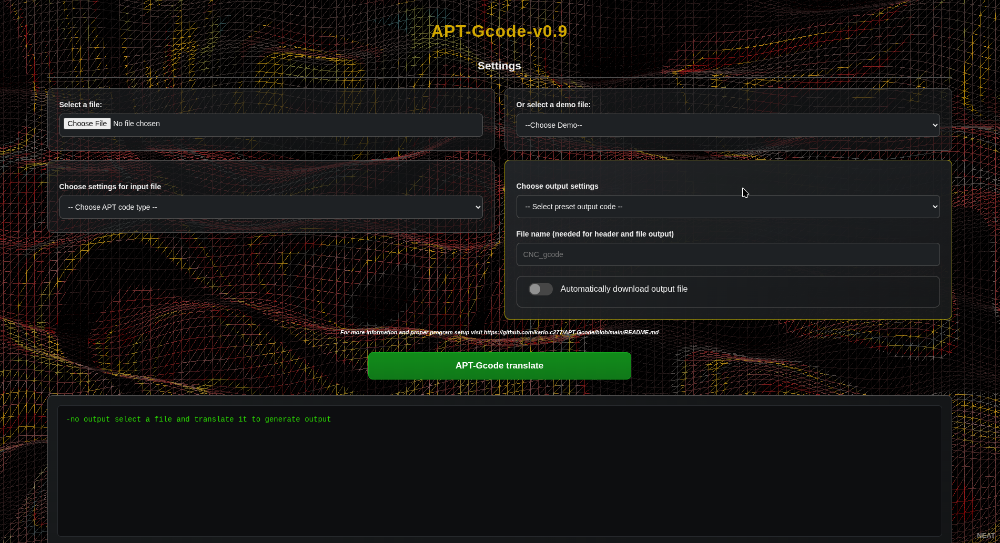

# APT-Gcode
This is an open source post processor for ATP files outputed by CAM programs  
It features - translating ATP commands into G-code, also it has select presets for output files, so you dont need to worry if your controler will open the file. But also it allows to make a costum file header, name and extension  
            - a very cool background in both localhosting and website use

# Usage
Just open up this link below, there are some DEMO files there for those who dont have APT files ready
http://karlougrin.com/apt_gcode-web/index-apt.html

# Documentatuion and recources
Most of information about APT and Gcode that I used is directly from school  
    https://archive.org/details/numericalcontrol0000stan for APT commands
    DOCUMENTATIONS -> Demo outputs -> All of those files 

# Main problem and some other issues
CATIA APT1.0 has 0 documentation, all that I could find were like 2 or 3 notifications about how they changed output for some commands and that is it.
Costs of Catia License, for the future I would like to test the newer Catia and other programs as well but they cost a lot

# Development plan
v0.9 CYCLE/ commands full support  
v1.0 Helix tool path support
v1.5 Complete Catia suport
v1.+ G-code output in ISO 6983, WinNC Sinumerik, WinNC Fanuc  
v2.0 SolidWorks APT code support  
v2.+ Support for other CNC controlers and APT codes

# Local run
1. Have VS Code or VS Codium
2. Have Latest-ih version of Node.js
3. Download zip file or clone the repo
4. Open in either one in editor
5. Run: npm install
6. Run: npm run dev
7. open this link: http://localhost:5173/index-apt.html

NOTE: doing so will open the newest version which may include some minor issues or bugs but it will contain some newer features that aren't available on website version

# More info
For more information you can look in folder DOCUMENTATIONS or contact karlo.ugrin@gmail.com
Make sure to read the walk-through
